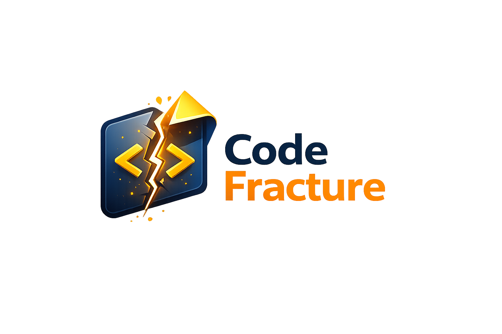

<p align="center">
  <br>
  A JavaFX JAR decompiler with syntax highlighting, multi-JAR support, and built-in source export.
</p>

---

## Features

- **Decompile JARs** — powered by [Vineflower](https://github.com/Vineflower/vineflower) for clean, readable output
- **Multi-JAR Support** — load several JARs simultaneously and navigate between them
- **Ctrl+Click Navigation** — jump to class definitions across all loaded JARs
- **JAR Comparison** — side-by-side diff of two JARs with line-level highlighting
- **Class Search** — filter the class tree by name in real time
- **Export Source** — save a single class as `.java`, export the entire JAR as a source `.zip`, or upload to a paste service
- **Obfuscation Detection** — automatically warns when a JAR appears to be obfuscated

## Installation

Download the latest installer for your platform from the [Releases](https://github.com/brainsynder-Dev/CodeFracture/releases) page:

| Platform | Installer |
|----------|-----------|
| 🪟 Windows | `.msi` |
| 🐧 Linux   | `.deb` |

## Building from Source

Requires JDK 21+.

```bash
# Run in development
./gradlew run

# Build fat JAR
./gradlew shadowJar

# Windows distributable ZIP
./gradlew buildWindowsPackage

# Linux tar.gz
./gradlew buildLinuxPackage
```

## Usage

1. **Open a JAR** — click *Open JAR* or drag and drop a `.jar` / `.class` file onto the window
2. **Browse classes** — use the left-hand tree or the search field to find a class
3. **Decompile** — click any class node to decompile and view the source
4. **Navigate** — Ctrl+Click an identifier to jump to its definition
5. **Export** — click *Export Source* to save a class, export the whole JAR as a ZIP, or upload to a paste service
